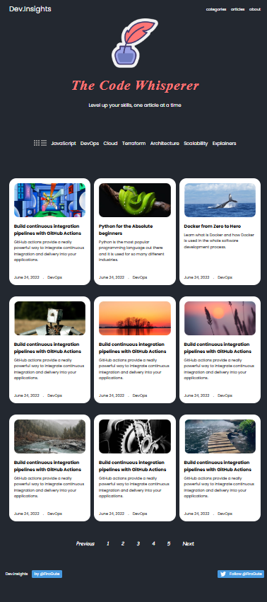

# dev.insights 🌟

## Welcome to **dev.insights!** 

I’m on a journey to master web development, and I’m excited to share what I’ve developed with you! This modern web application serves as a platform for developers to explore valuable resources, articles, and tutorials on various tech topics.

## Screenshot


## Features

- **Responsive Design**: The application is built with responsive design principles, ensuring an optimal viewing experience across a wide range of devices.
- **User -Friendly Interface**: Navigate effortlessly through our clean and intuitive layout.

## Technologies Used

- **HTML**: For structuring the content of the application.
- **CSS**: For styling and layout, ensuring a visually appealing interface.

## Getting Started

To get a local copy of this project up and running, follow these simple steps:

1. **Clone the repository**:
   ```bash
   git clone https://github.com/firogute/dev.insights.git
   ```
2. **Navigate to the project directory:**

   ```bash
   cd dev.insights
   ```

3. Open index.html in your web browser to view the application.

✨ I’d love to hear from you! If you have any questions, feedback, or suggestions, don’t hesitate to reach out. Together, let’s continue to build and innovate. Happy coding! 🚀
